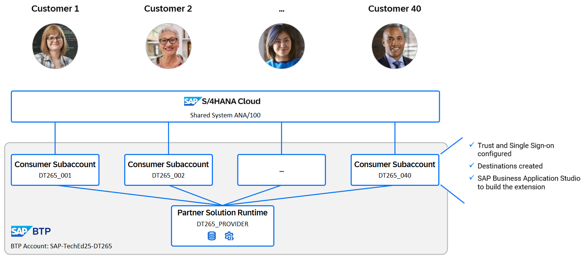

# Getting Started

In this chapter, you will get familar with the system lanscape of this hands-on session. You will have a look on:
- the provider SAP BTP subaccount where the base application *Poetry Slam Manager* is deployed,
- the subscriber SAP BTP subaccount of the customer you serve, and
- the development environment.

## Get an Overview of the System Lanscape

After completing these steps you will have an overview of the system landscape of this hands-on session. The image shows the landscape:

- There is one SAP BTP global account that illustrates the partner global account. 
- In this global account a provider subaccount and 40 customer subaccounts are created.
- Each customer subaccount has single sing-on and the development environment configured.
- All customer subaccounts integrate the same SAP S/4HANA  Cloud system.

## Get an Overview of the Provider SAP BTP Subaccount

After completing these steps you will have an overview about the provider SAP BTP subaccount.

1. Open the provider subaccount in the SAP BTP Cockpit.
2. Navigate to *Services* -> *Instances and Subscriptions*.
3. View the instances and subscriptions. 
    You can see that several application subscriptions, instances and an environment are available. 
    1. The application subscriptions are:
          1. Forms Service by Adobe: Required to configure and manage form templates.
          2. SAP HANA Cloud tools: The tools to access the SAP HANA Cloud database.
          3. *Poetry Slam Manager*: Subscription of the base application. 
          4. SAP Business Application Studio: The development environment used for this demo.
    2. The instances are part of the deployed *Poetry Slam Manager* application and required to run it with all features.     
    3. On the environment Cloud Foundry Runtime the *Poetry Slam Manager* application is running.
4. Navigate to *Destinations*.
5. View the existing destinations.
     There are three destinations created. They are required to offer a SAP Build Work Zone launchpad in the customer subaccount. 
     > Note: You can get more information beyond this excercise about how and why the destinations are created, in chapter [Enhance the Core Application for Deployment](https://github.com/SAP-samples/partner-reference-application/blob/main/Tutorials/23-Multi-Tenancy-Develop-Sample-Application.md) of the Partner Reference Application.

> Note: The configuration of the provider subaccount is described in more detail in chapter [Bill of Materials](https://github.com/SAP-samples/partner-reference-application/blob/main/Tutorials/01-BillOfMaterials.md) of the Partner Reference Application.

## Get an Overview of the SAP BTP Subaccount of your Customer

After completing these steps you will have an overview about the subscriber SAP BTP subaccount of your customer.

1. Switch to the SAP BTP subaccount of your customer.
2. Navigate to *Services* -> *Instances and Subscriptions*.
3. View the instances and subscriptions. 
     1. The application subscriptions are:
          1. Print Service: Enables the customer to manage print queues.
          2. SAP Business Application Studio: The development environment used for this demo.
     2. The instances are: 
          Access to the print service and to the service broker.
     3. On the environment Cloud Foundry Runtime, the Caterer extension will be deployed.
5. Navigate to *Destinations*.
6. View the existing destinations.
     1. print-service: Adds the application to manage print queues to SAP Build Work Zone.

## Configure the Development Environment

After completing these steps you will have accessed and configured the SAP Business Application Studio to develop your customer-specific extension.

1. In the SAP BTP subaccount of your customer, navigate to *Services* -> *Instances and Subscriptions*.
3. Open the *SAP Business Application Studio*.
4. Create a new dev space.
5. Enter a *Dev Space name*, for example *PartnerReferenceApplicationExtension*.
6. Select *Full Stack Cloud Application*.
7. Create the dev space. The dev space is now in status *STARTING*. You can move on as soon the status changes to *RUNNING*.
8. Open the *PartnerReferenceApplicationExtension* dev space.

> Note: The preconditions for these steps are described in more detail in chapter [Prepare Your SAP BTP Account for Development](https://github.com/SAP-samples/partner-reference-application/blob/main/Tutorials/11-Prepare-BTP-Account.md) of the Partner Reference Application.

## Summary

Now that you have on overview of the SAP BTP subaccounts and configured your SAP Business Application Studio as development environment, continue to [Provision Your Multi-tenant Solution to Your Customer](../ex1/README.md)
