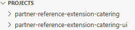

# Exercise 2 - Build and Deploy a Customer-Specific Extension for Your Customer

In this exercise, you create a tenant-specific extension called **Caterer Management**. This extension lets you select a caterer for a poetry slam in your customer's **Poetry Slam Manager**.

> Note: Some steps are required to enable extensibility in the **Poetry Slam Manager** base application. You can get more details in chapter [Enable Consumer-Specific Extensions](https://github.com/SAP-samples/partner-reference-application/blob/main/Tutorials/50-Multi-Tenancy-Features-Tenant-Extensibility.md) of the Partner Reference Application.

## Exercise 2.1 - Extend the Persistence and the User Interface With Custom Fields

After completing these steps, you have extended the **Poetry Slam Manager** of your customer with a **Caterer** section in which a caterer for the event can be selected.

### Create a New Project Based on SAP Cloud Application Programming Model

First, create an extension project. This project is a standard SAP Cloud Application Programming Model-based project designed to extend the functionality of the **Poetry Slam Manager** application.

1. Open the SAP Business Application Studio in your **customer subaccount**.

2. Open the space you created in Excercise 1.

3. To start a new development project, go to the settings and open the **Command Palette** or press CTRL + SHIFT + P.

4. Search for `SAP Business Application Studio: New Project from Template`.

5. Make sure the target folder path is set to `home/user/projects`. 

6. Choose **CAP Project** and select **Start**. 

7. Add the following attributes to the **CAP project** and choose **Finish**:
    - As **project name**, enter `partner-reference-extension-catering`.
    - As **runtime**, select `Node.js`.

    As a result, a folder named `partner-reference-extension-catering` is created. It contains a set of files to help you start a SAP Cloud Application Programming Model project.

8. Adapt the created *package.json* to incorporate the following configurations. For reference, have a look at the [package.json](https://github.com/SAP-samples/partner-reference-application-extension/blob/main/partner-reference-extension-catering/package.json) file in the Partner Reference Application Extension.

    ```json
    {
      "extends": "partner-reference-application",
      "workspaces": [
        ".base"
      ]
    }
    ```

    - `extends` is the identifier used by the extension model to reference the base model. It must be a valid base application name, as it serves as the package name for the base model when executing `cds pull`.
    - `workspaces` is a list of folders, including the one where the base model is stored. If not already present, the `cds pull` command will automatically add this property to ensure proper configuration.

### Assign Extension Developer Role

To extend the base model, assign the `PoetrySlamExtensionDeveloperRoleCollection` role collection to your user in the **customer subaccount**. 

> Note: The `PoetrySlamExtensionDeveloperRoleCollection` role collection is established within the base model as part of the extension enablement process. For more details beyond this excercise, refer to [Partner Reference Application tutorial - *Poetry Slam Manager* Application with extensibility](https://github.com/SAP-samples/partner-reference-application/blob/main/Tutorials/50-Multi-Tenancy-Features-Tenant-Extensibility.md#application-enablement).

### Pull the Base Model

To enable local testing and syntax highlighting, you need to ensure that the model information of the **Poetry Slam Manager** base application is known to the extension project. The CDS compiler requires the base model as an NPM package within the `node_modules` folder.

The following section explains how to retrieve the model from the running application and make it available locally using the CDS pull command.

1. To simplify the use of multitenancy-related commands, such as `cds pull` and `cds push`, you can enable automatic authentication. First, log in using the appropriate credentials.

   1. Get the URL of the multitenancy extension module (MTX) deployed in the provider subaccount.

      1. In the SAP BTP cockpit of the **provider subaccount** ([*DT265_PROVIDER*](https://emea.cockpit.btp.cloud.sap/cockpit?idp=teched01.accounts.ondemand.com#/globalaccount/bab22592-b4b6-405e-add4-a6f3d9869306/subaccount/ed30d4c9-9da7-421c-bd08-c5ae51337fce/subaccountoverview)), navigate to the SAP BTP Cloud Foundry runtime space where the application is deployed. The **Applications** deployed to the space are shown.

      2. Select the **poetry-slams-mtx** link.

      3. Copy the **Application Route** from the **Application Overview** for later use (**provider mtx URL**).

   2. Get the **Client Credentials** of the MTX module.

      1. On the same screen, select **Environment Variables** of the MTX module.
      2. In the JSON file of the **System-Provided** section, locate the *xsuaa* array.
      3. Copy the **clientid** and **clientsecret** of the **credentials** property.

   3. Get the subdomain from the customer subaccount as follows:

        1. In the SAP BTP cockpit of the customer subaccount, navigate to *Overview*.
        2. Copy the *Subdomain* from the *General* section and note it as **customer subdomain**. You will require it in later steps again. 

   4. Open a new terminal in your SAP Business Application Studio space (Strg + Shift + C). 
   
   5. In the terminal, execute the following statement to log in to the MTX module:

         ```bash
         cds login <PROVIDER-MTX-APP-URL> -s <SUBDOMAIN-OF-YOUR_CUSTOMER> -c '<CLIENT-ID>':'<CLIENT-SECRET>' --plain
         ```

2. Pull the latest CDS model from the provider subaccount to the `partner-reference-extension-catering` extension project.

   1. Run the following command. Use the copied application route **provider mtx URL**.

      ```bash
      cds pull --from <PROVIDER-MTX-APP-URL>
      ```

### Install the Base Model

To prepare the downloaded base model for use in your extension project, install it by running the `npm install` command.

> Note: This links the base model in the workspace folder to the `node_modules/partner-reference-application`sub directory.

### Write the Extension Code

It's not mandatory to split the extension model into multiple files. However, for better maintainability, CAP recommends structuring it similarly to a standard SAP CAP application. The data model enhancements should be placed in the `db` folder, service enhancements in the `srv` folder, and UI annotations in the `app` folder. This approach ensures a well-organized project structure and aligns with best practices.

1. To extend the data model, you create a new entity called *x_Caterers* and extend the existing **PoetrySlams** entity by adding an association to it.

    1. Create a file named `catererManager.cds` in the **/db** folder, which references all the entity definitions (cds-file of the data model).

    2. Copy the following content into the newly created file:

      ```javascript
      namespace  x_sap.samples.poetryslams.catering;
      using {sap.samples.poetryslams.PoetrySlams, cuid, managed,sap } from 'partner-reference-application';

      // Define a new code list.
      entity x_CuisineTypeCodes: sap.common.CodeList {
         key code : String(25) default '1' @title : '{i18n>cuisineType}'
      }

      // Define a new entity.
      entity x_Caterers : cuid,managed {
         name               : String(255) @mandatory @title : '{i18n>name}'; 
         contactPerson      : String(255) @title : '{i18n>contactPerson}';
         phone              : String(30) @title : '{i18n>phone}';
         email              : String @assert.format: '^[\w\-\.]+@([\w-]+\.)+[\w-]{2,4}$' @title : '{i18n>email}';
         cuisine            : Association to one x_CuisineTypeCodes;
         maxServiceCapacity : Integer @title : '{i18n>maxServiceCapacity}';
      }

      // Enhance the entity PoetrySlams of the base application.
      // Prefix x_ is based on the configuration maintained in the base application. https://cap.cloud.sap/docs/guides/multitenancy/mtxs#extensibility-config
      // This ensures that artifacts of the extension do not conflict with those in the base application, maintaining consistency and avoiding naming collisions.
      extend PoetrySlams with {
         x_caterer : Association to one x_Caterers @title: '{i18n>caterer}'
      }

      annotate x_Caterers with {
         cuisine @Common : { 
            Label : '{i18n>cuisine}',
            Text : {
               $value : cuisine.name,
               ![@UI.TextArrangement]: #TextOnly,
            },
         }
      } ;
      ```

      > Note: By using the `extend` directive, you can add new fields to existing entities, create new entities, and further more. Details beyond this excercise can be found in chapter [Extending the Data Model](https://cap.cloud.sap/docs/guides/extensibility/customization#extending-the-data-model) of the capire docmentation.
       
      > Note: For more information beyond this excercise on how the prefix `x_` is defined in the base application, have a look at the chapter [Partner Reference Application tutorial - Poetry Slam Manager Application with Extensibility](https://github.com/SAP-samples/partner-reference-application/blob/main/Tutorials/50-Multi-Tenancy-Features-Tenant-Extensibility.md#application-enablement).

2. To extend the service model, you enhance the existing service of the base application. The newly created entities of the data model are automatically included in a read-only manner. They serve as targets for the corresponding compositions. You can also explicitly expose them as writable.

    1. Create a file called `catererManagerService.cds` in the **/srv** folder, which includes all service definitions (cds-file of the service).  

    2. Copy the following content into the newly created file: 

        ```cds
        using { x_sap.samples.poetryslams.catering.x_Caterers as caterers } from '../db/catererManager';

        // Extend the PoetrySlamService of the base application with the X_Caterers entity.
        extend service PoetrySlamService with{
            entity x_Caterers as projection on caterers;
        }
        ```

3. Once you have defined the domain and service model, you extend UI annotations. You add a new **Caterer** section between the **General** and the **Visitors** sections using the `... up to` and `...` keywords. The following code demonstrates how to seamlessly insert a new UI facet between the existing facets in the base application, enhancing its functionality while preserving the integrity of the current layout:

   1. Create a file called `catererManager.cds` in the **/app** folder, which references all UI annotations (cds-file of the UI).
   2. Copy the content of the [catererManager.cds](https://github.com/SAP-samples/partner-reference-application-extension/blob/main/partner-reference-extension-catering/app/catererManager.cds) of the Partner Reference Application Extension into the newly created file.
   3. Create a new folder called `i18n` in the **partner-reference-extension-catering** folder.
   3. Create new file called `i18n.properties` in the newly created i18n-folder to support translation.
   4. Copy the content of the [i18n.properties](https://github.com/SAP-samples/partner-reference-application-extension/blob/main/partner-reference-extension-catering/i18n/i18n.properties) of the Partner Reference Application Extension into the newly created file.

   > Note: Extending UI annotations in SAP CAP Extension Development allows you to customize and enhance the user interface of a base application without altering its core functionality. Details beyond this excercise can be found in chapter [Extending UI Annotations](https://cap.cloud.sap/docs/guides/extensibility/customization#extending-ui-annotations) of the capire docmentation.

### Create an Initial Data Set

  Create an initial data set that's available after you've started the application. You can specify the data in SAP CAP by creating a set of CSV files in the **/db/data** folder of the project. 

  1. Create a file called x_sap.samples.poetryslams.catering-x_CuisineTypeCodes.csv in the **/db/data** folder.
  
  2. Copy the data from [x_sap.samples.poetryslams.catering-x_CuisineTypeCodes.csv](https://github.com/SAP-samples/partner-reference-application-extension/blob/main/partner-reference-extension-catering/db/data/x_sap.samples.poetryslams.catering-x_CuisineTypeCodes.csv) into the newly file. It adds the cuisine data to the entity.

  2. Create a file called x_sap.samples.poetryslams.catering-x_Caterers.csv in the **/db/data** folder.
  
  3. Copy the data from [x_sap.samples.poetryslams.catering-x_Caterers.csv](https://github.com/SAP-samples/partner-reference-application-extension/blob/main/partner-reference-extension-catering/db/data/x_sap.samples.poetryslams.catering-x_Caterers.csv) into the newly created file. It adds the caterer data to the entity.

  > Note: This adds caterer data for demonstration purposes. It's not suitable for a production environment. 

  > Note: For more details beyond this excercise, refer to the [Partner Reference Application tutorial - Create an Initial Data Set](https://github.com/SAP-samples/partner-reference-application/blob/main/Tutorials/14-Develop-Core-Application.md#create-an-initial-data-set).

### Deploy the Extension
  
Now that you have added your extension code, you deploy it by pushing the code to your customer subaccount. This ensures that your extension code is isolated to your subaccount, preventing any impact on other customer subaccounts.

To push the extension code to the customer subaccount, follow these steps:

1. Use the URL of the MTX module deployed in the provider subaccount. You noted it down as **provider mtx URL**.

2. Use the subdomain from the customer subaccount. You noted it down as **customer subdomain**.

```bash
cds push --to <PROVIDER-MTX-APP-URL> -s <SUBDOMAIN-OF-YOUR-CUSTOMER-SUBACCOUNT>
```

A new **Caterer** section is introduced in the **Poetry Slam Manager** application within your customer subaccount, enabling you to effortlessly select caterers for your events.

## Exercise 2.2 - Develop a SAP Fiori UI to Manage the Customer Entity

After completing these steps, you have created a SAP Fiori elements app to manage caterers for the poetry slam events.

> Note: The SAP BTP Cloud Foundry runtime environment is required in the subaccount of your customer, as the web application will be deployed to manage caterer information. In this demo, it is already enabled. For more details beyond this excercise, refer to the [Partner Reference Application tutorial - Enable SAP BTP Cloud Foundry Runtime](https://github.com/SAP-samples/partner-reference-application/blob/main/Tutorials/22-Multi-Tenancy-Prepare-Deployment.md#enable-sap-btp-cloud-foundry-runtime).

### Get Poetry Slam Manager EDMX

You consume the metadata of the **Poetry Slams** OData service from the customer subaccount where the back end is independently managed. This metadata is then utilized to create the SAP Fiori elements project. To obtain the metadata, follow the steps outlined below:

1. Create a folder,for example `partner-reference-extension-catering-ui` in your workspace in SAP Business Application Studio. The path should be **home/user/projects-folder/partner-reference-extension-catering-ui**.
   
   1. Open a new terminal in SAP Business Application Studio (Strg + Shift + C).
   2. The terminal should show the **partner-reference-extension-catering** folder. Navigate to **projects** folder by using the `cd ..` command. 
   3. Run the `mkdir partner-reference-extension-catering-ui` command to create a new folder.
   4. Navigate to the new folder in the terminal by using the `cd partner-reference-extension-catering-ui` command. 
   5. Add the folder to your workspace. Choose the sandwich button on the top left corner and choose **File -> Add Folder to Workspace...**.
   6. Select the newly created folder called **partner-reference-extension-catering-ui**.
   
   Your project structure should look like this:
   <br>

2. Create a new file, called **PoetrySlamService.edmx**, in the folder **partner-reference-extension-catering-ui**.
3. Get the metadata of the base application by following these steps:

   1. Open a new web browser tab.
   2. Paste the application URL **launchpad site URL** into the browser's address bar and press **Enter**.
   3. Enable the **Developer Tools**.

      > Note: You can enable **Developer Tools** in *Google Chrome* using a keyboard shortcut:
      >
      > 1. Windows/Linux: Press `Ctrl + Shift + I` or `F12`.  
      > 2. Mac: Press `Cmd + Option + I`.

   4. Navigate to the **Poetry Slam Events** application.
   5. In the **Network** tab's filter bar, type `$metadata` to filter the requests related to the metadata.
   6. Copy the response of the metadata API call.

3. Paste the metadata into the *PoetrySlamService.edmx* file. 

### Add a Web Application with SAP Fiori Elements

You create the SAP Fiori elements project by uploading the metadata using the **SAP Fiori Elements Application Wizard** under the **partner-reference-extension-catering-ui** folder.

1. To start a new development project, go to the settings in SAP Business Application Studio from your customer subaccount and open the **Command Palette**.
2. To start the wizard, search for **SAP Business Application Studio: New Project from Template** in the **Command Palette...**.
3. Select the **SAP Fiori Generator** module template and choose *Start*. 
4. Choose **List Report Page** and choose *Next*.
5. Select the data source and the OData service as follows:
   - **Data source**: Upload a Metadata Document
   - **Metadata file path**: Upload the metadata file created in the previous section
6. Select the main entity from the list:
   - **Main entity**: x_Caterers
   - **Automatically add table columns**: Yes
   - **Table Type**: Responsive
7. Add further project attributes. For attributes that aren't listed, use the default:
   - **Module name**: caterer
   - **Application title**: Caterers
   - **Application namespace**: leave empty
   - **Description**: Application to create and manage caterers
   - **Project folder path**: Choose the project folder. Make sure that the target folder path is set to `/home/user/projects/partner-reference-extension-catering-ui`.
   - **Add deployment configuration**: Yes
8. Select the deployment configuration:
   - **Please choose the target**: Cloud Foundry
   - **Destination name**: none
   - **Add Router Module**: Add Application to Managed Application Router
9. Choose **Finish**. The wizard creates the **caterer** folder, which contains all files related to the user interface.

### Fine-Tune the User Interface

Creating the extension UI follows the same process as developing the standard UI for the **Poetry Slam Manager** application. For more information beyond this excercise, you can have a look at the [Partner Reference Application tutorial - Fine-Tune the User Interface](https://github.com/SAP-samples/partner-reference-application/blob/main/Tutorials/14-Develop-Core-Application.md#fine-tune-the-user-interface).

Copy the following files:

1. Overwrite the `caterer/webapp/manifest` file with the [`manifest.json`](https://github.com/SAP-samples/partner-reference-application-extension/blob/main/partner-reference-extension-catering-ui/caterer/webapp/manifest.json) file from the Partner Reference Application Extension. It describes the application structure, routing, services, dependencies, and SAP Fiori launchpad integration. The **crossNavigation** section must be defined to enable intent-based navigation, allowing the app to be launched using a specified semantic object and action.
2. Overwrite the `caterer/webapp/annotations/annotation.xml` file with the [`annotation.xml`](https://github.com/SAP-samples/partner-reference-application-extension/blob/main/partner-reference-extension-catering-ui/caterer/webapp/annotations/annotation.xml) file from the Partner Reference Application Extension. It defines UI-specific annotations that dictates how data is displayed and behaves in the SAP Fiori application.
3. Overwrite the `caterer/webapp/i18n/i18n.properties` file with the [`i18n.properties`](https://github.com/SAP-samples/partner-reference-application-extension/blob/main/partner-reference-extension-catering-ui/caterer/webapp/i18n/i18n.properties) file from the Partner Reference Application Extension. It takes care of the translation of the UI into different languages.

### Add Destination Route to App Router

To ensure secure communication between the new SAP Fiori application and the core **Poetry Slam Manager** OData service, all requests from the SAP Fiori application must be routed. This is achieved by configuring the routing rules in the [xs-app.json](https://github.com/SAP-samples/partner-reference-application-extension/blob/main/partner-reference-extension-catering-ui/caterer/xs-app.json) file. Add the following destination route as the first entry in the route configuration:

```json
{     
   "source": "^/odata/v4/poetryslamcaterer/(.*)$",
   "target": "/odata/v4/poetryslamservice/$1",
   "destination": "poetry-slams-caterer",
   "authenticationType": "xsuaa",
   "csrfProtection": true
}
```

> Note: For more information about the properties, check the [Partner Reference Application Extension tutorial - Add Destination Route to App Router](https://github.com/SAP-samples/partner-reference-application-extension/blob/main/Tutorials/03-FioriUIForExtendedEntity.md#add-destination-route-to-app-router).

### Service Broker Setup

This chapter provides information only. In this demo scenario, the service broker is already set up in the customer subaccount. You don't need to take any action.

To access the **Poetry Slams** OData services from your SAP Fiori application, the service broker is set up. It enables secure access to application OData services by utilizing tenant-specific credentials and authorizations. This ensures effective tenant isolation in a multi-tenant application environment. 

> Note: In case you want to get more information on how the service broker is added to the **Poetry Slam Manager** application, refer to the [Partner Reference Application tutorial - Enable API Access to SAP BTP Applications Using Service Broker](https://github.com/SAP-samples/partner-reference-application/blob/main/Tutorials/42a-Multi-Tenancy-Service-Broker.md#enable-api-access-to-sap-btp-applications-using-service-broker).


### Create the Destination to Access the Base Application

You need to create a destination in the customer subaccount to connect to the **Poetry Slams** OData service using the service broker instance. This destination was configured in the [xs-app.json](https://github.com/SAP-samples/partner-reference-application-extension/blob/main/partner-reference-extension-catering-ui/PoetrySlamService.edmx) file to enable tenant-specific data calls in an earlier step.

In the SAP BTP consumer subaccount, go to **Connectivity** and choose **Destinations** to create a new destination with the following field values:

| Parameter Name    | Value                                                                                             |
| :---------------- | :------------------------------------------------------------------------------------------------ |
| **Name**            | poetry-slams-caterer                                                                            |
| **Type**            | HTTP                                                                                            |
| **Description**     | Destination description. For example, `Poetry Slams Manager`.                                  |
| **URL**             | Get the endpoint of the service broker instance *psm-sb-sub1-full*. *Check the details below*                              |
| **Proxy Type**      | Internet                                                                                        |
| **Authentication**  | OAuth2UserTokenExchange                                                                         |
| **Client Id**       | Get the client id from the service key of the service broker instance *psm-sb-sub1-full*. *Check the details below*                                                                        |
| **Client secret**   | Get the client secret from the service key of the service broker instance *psm-sb-sub1-full*. *Check the details below.*                                                                        |
| **Token Service URL**:      | Get the URL of the uaa-section from the service key of the service broker instance *psm-sb-sub1-full* and add `/oauth/token`.  *Check the details below*       |
| **Token Service URL Type**: | Dedicated                                                                               |

Details:
- To open the service key of the service broker instance *psm-sb-sub1-full* in the customer subaccount, follow these steps:
   1. In the SAP BTP cockpit of the customer subaccount, navigate to *Services* -> *Instances and Subscriptions*.
   2. View the credentials of the service broker instance *psm-sb-sub1-full*.
   3. Use the *psm-servicebroker* in section *endpoints* as **URL**.
   4. Get the **client id** and **client secret** from the *uaa*-section.
   5. For the **Token Service URL**, get the *URL* of the *uaa*-section and add `/oauth/token`. 

### Deploy to Cloud Foundry

Now that you have completed all the development and configurations, you can proceed to deploy the application.

1. In the SAP Business Application Studio, open a new terminal and navigate into the `home/user/projects/partner-reference-extension-catering-ui` folder.
2. Log on to SAP BTP Cloud Foundry runtime:
   1. Run the command: 
      
      ```
      cf login -a https://api.cf.eu10-004.hana.ondemand.com --origin teched01-platform
      ```

   2. Enter your development user and password.
   3. Select the org of the **SAP BTP customer subaccount for the application (*dt2650nn*)**. Replace nn with the number of your customer.
      > Note: The SAP BTP Cloud Foundry runtime space of your customer (*DT265*) is selected by default.

3. Navigate into the **caterer** folder with the `cd caterer` command.
4. To install the dependencies, run the `npm install` command.
5. To build the application, run the `npm run build:mta` command.
6. To deploy the application, run the `npm run deploy` command.

### Configure SAP Build Work Zone

You already created a *Launchpad Site* in SAP Build Work Zone for the **Poetry Slam Manager** application. Now you have to add the **Caterer** web application.

#### Add Web Application to the Content Manager

The Content Manager is the central place to manage applications, roles, and groups in SAP Build Work Zone. Applications must be added to the content repository before they can be assigned to users.

1. Open the **SAP Build Work Zone, standard edition** application under **Services -> Instances and Subscriptions** in the **customer subaccount**. The site manager is opened.
2. Open the **Channel Manager**.
3. Update the **HTML5 Apps** content channel using the **Update content** button on the right side of the table to get the latest changes of your application.
4. Go to the **Content Manager**.
5. Select **Content Explorer**.
6. Choose **HTML5 Apps**.
7. Select the **Caterer** web application.
8. Choose *Add*.

#### Assign the Application to a Role

Role assignments define who can access and interact with an application within the launchpad. By assigning the application to the **Everyone** role or any specific role based on business needs, you ensure that authorized users can see and use the application. The **Everyone** role is assigned to a site by default.

1. Open the **Content Manager**.
2. Click on the **Everyone** role (available by default).
3. Edit the role.
4. Assign the **Caterer** application to this role.
5. Save your changes.

#### Create a New Group for the Application

Creating a group allows you to categorize applications based on functionality, user roles, or business processes. This improves accessibility by ensuring that related applications appear together in a structured manner.

1. Open the **Content Manager**.
2. Create a new **Group**.
3. Enter a title, for example **Caterer**, and a description, for example **Maintain caterer** for better organization.
4. Add the **Caterer** application to the newly created group.
5. Save your changes.

## Test the Extension

1. Now, let's add a new caterer. Launch the **Caterer** application.

    1. Open the SAP Build Work Zone launchpad you created and enhanced with the extension. Use the URL **launchpad site URL** you noted down before.
    2. Choose **Caterer**.

2. A list of existing caterers is displayed in the table. Choose **Create** and enter the following details:

    1. **Name**: Goose   
    2. **Contact Person**: Peter 
    3. **Phone**: +555-1212
    4. **Email**: peter@goosesap.com
    5. **Cuisine**: Mexican
    6. **Maximum Service Capacity**: 300

3. Choose **Create** to add a new caterer.
4. Switch to the **Poetry Slam Manager** solution of your customer.
5. Open the **Poetry Slam Events** app.
6. Select a published poetry slam.

   You can see that the new **Caterer** section is available.
7. Choose **Edit** and select the newly created caterer for your event from the predefined list. The poetry slam is updated with the caterer information.
8. Save your changes.

## Summary

You've now extended the **Poetry Slam Manager** subscription of your customer with the **Caterer** extension.

Continue with [personalizing the user interface for all users of your customer](../ex3/README.md).
